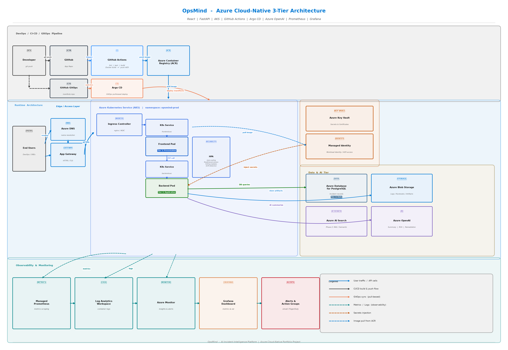

# OpsMind – Architecture Documentation

**Project:** OpsMind – AI Incident Intelligence Platform
**Type:** Cloud-Native, 3-Tier, Azure-hosted
**Stack:** React · FastAPI · PostgreSQL · AKS · GitHub Actions · Argo CD · Azure OpenAI

---

## What is OpsMind?

OpsMind is an AI-assisted incident intelligence platform built for DevOps engineers and SREs. When a production incident occurs, engineers can log it in OpsMind. The platform uses Azure OpenAI to automatically generate an incident summary, identify the probable root cause, and suggest remediation steps — saving the team the time it takes to write post-mortems manually.

The project is designed to demonstrate end-to-end cloud-native engineering skills: a production-grade 3-tier application deployed on Azure Kubernetes Service, delivered through a GitOps pipeline, and observed through a full monitoring stack.

---

## Architecture Diagram



---

## 3-Tier Structure

OpsMind follows a strict 3-tier application model. Each tier is independently deployable and runs as its own Kubernetes workload.

| Tier | Component | Technology | Responsibility |
|------|-----------|------------|----------------|
| Tier 1 – Presentation | Frontend Pod | React 18 + Vite + TypeScript | Renders the incident dashboard, search, create form, and AI summary panel |
| Tier 2 – Application | Backend Pod | FastAPI + SQLAlchemy + Python | Exposes REST API, handles business logic, calls Azure OpenAI, queries the database |
| Tier 3 – Data | Azure Database for PostgreSQL | PostgreSQL + full-text search | Stores all incident records persistently |

The frontend never talks to the database directly. It only talks to the FastAPI backend via HTTP. The backend is the only tier that touches data stores.

---

## Layer-by-Layer Breakdown

### 1. Users Layer

End users — DevOps engineers, SREs, and on-call teams — access the OpsMind dashboard from a browser. They can:

- View all incidents in a filterable card list
- Search incidents by keyword (full-text search in PostgreSQL)
- Create new incidents with severity, service, and team metadata
- Click an incident to see details and trigger AI summarization

The user sends HTTPS requests from their browser. All traffic goes through the Azure edge layer before reaching the application.

---

### 2. Edge / Access Layer

**Azure DNS**
Maps the domain name (e.g., `opsmind.example.com`) to the Azure Application Gateway's public IP. DNS resolution happens before the request reaches any application code.

**Azure Application Gateway**
Acts as the Layer 7 load balancer and TLS termination point. It:
- Terminates the HTTPS connection (handles the SSL/TLS certificate)
- Forwards decrypted HTTP traffic to the Kubernetes Ingress Controller
- Can enforce WAF (Web Application Firewall) rules for production security

All traffic between the user and the application is encrypted in transit via HTTPS.

---

### 3. Application Layer – Azure Kubernetes Service (AKS)

The entire application runtime runs inside an AKS cluster. The cluster is divided into a namespace — `opsmind-prod` for production and `opsmind-dev` for development.

**Ingress Controller (nginx / AGIC)**
The Ingress Controller is the first component inside the cluster that receives traffic from the Application Gateway. It reads Kubernetes Ingress rules and routes:
- Requests to `/` → Frontend Service → Frontend Pod
- Requests to `/api/*` → Backend Service → Backend Pod

**Frontend Deployment (React UI)**
- A Kubernetes Deployment runs one or more replicas of the React frontend container
- The container serves the pre-built static React bundle
- A Kubernetes Service (`frontend-svc`) provides a stable internal IP and load balances across replicas
- The frontend calls the backend over the internal Kubernetes network

**Backend Deployment (FastAPI)**
- A Kubernetes Deployment runs one or more replicas of the FastAPI backend container
- Exposes REST endpoints: `GET /api/incidents/`, `POST /api/incidents/`, `GET /api/search/`, `POST /api/ai/summarize`
- A Kubernetes Service (`backend-svc`) provides a stable internal DNS name for the backend
- The backend connects to Azure PostgreSQL and Azure OpenAI

**Horizontal Pod Autoscaler (HPA)**
The HPA watches CPU and memory metrics from both the Frontend and Backend Deployments. If traffic increases and resource usage crosses a threshold, Kubernetes automatically adds more pod replicas. When traffic drops, it scales back down to save cost.

**Reliability Features inside AKS**
- **Readiness Probes** – Kubernetes checks if a pod is ready to serve traffic before routing requests to it. A pod that fails readiness is taken out of rotation.
- **Liveness Probes** – Kubernetes checks if a pod is healthy. A pod that fails liveness is automatically restarted.
- **Rolling Updates** – When a new image is deployed, Kubernetes replaces pods one by one, ensuring zero downtime.
- **Drift Detection** – Argo CD continuously compares the live cluster state with the GitOps manifests. Any manual change to the cluster is flagged as drift and can be automatically corrected.

---

### 4. Data Layer

**Azure Database for PostgreSQL**
Stores all incident records. Each incident has: title, description, severity, status, service, team, RCA notes, and remediation steps. The database uses PostgreSQL's built-in `tsvector` and `plainto_tsquery` features for full-text search — when a user searches for "database timeout", PostgreSQL searches across all text fields efficiently without needing a separate search engine.

**Azure Blob Storage**
Stores unstructured data such as:
- Log exports from incidents
- Runbook documents uploaded by engineers
- Binary artifacts (screenshots, diagnostic dumps)

This keeps large files out of the relational database where they would degrade query performance.

**Azure AI Search** *(Phase 2 – planned)*
In a future phase, Azure AI Search will store vector embeddings of incident descriptions. This will enable semantic search — finding related incidents not just by keyword match but by meaning. For example, searching "latency spike" would also surface incidents described as "slow response times" even if those exact words are not present.

---

### 5. AI Layer

**Azure OpenAI**
The backend calls Azure OpenAI when a user clicks "Summarize" on an incident. The backend sends a structured prompt containing the incident title, description, severity, service, team, and any existing RCA notes. Azure OpenAI returns a JSON response with three fields:

- **Summary** – A plain-English paragraph explaining what happened
- **Probable Cause** – One or two sentences identifying the most likely root cause
- **Remediation** – A numbered list of steps to resolve or prevent recurrence

The `USE_MOCK_AI=true` environment variable switches the backend into mock mode for local development, returning a realistic hardcoded response without making any API calls or incurring cost.

---

### 6. DevOps / CI-CD Layer

The delivery pipeline is fully automated. A developer never manually builds a Docker image or applies Kubernetes manifests.

**Step 1 – Developer pushes code**
A developer pushes a code change to the application repository on GitHub (frontend or backend source code).

**Step 2 – GitHub Actions CI**
GitHub Actions detects the push and runs the CI pipeline:
1. **Lint** – Checks code style and formatting
2. **Test** – Runs unit and integration tests
3. **Build** – Compiles the TypeScript frontend or validates the Python backend
4. **Docker Build** – Builds a container image tagged with the Git commit SHA
5. **Push to ACR** – Pushes the image to Azure Container Registry

**Step 3 – Update GitOps manifests**
The CI pipeline (or a developer) updates the image tag in the GitOps manifests repository. This is a separate GitHub repository that contains only Kubernetes YAML files (Deployments, Services, Ingress, ConfigMaps, etc.).

**Step 4 – Argo CD deploys**
Argo CD runs inside the AKS cluster and continuously watches the GitOps manifests repository. When it detects a change (new image tag), it pulls the updated manifests and applies them to the cluster. This is a **pull-based** model — the cluster reaches out to GitHub, rather than a CI system pushing into the cluster. This is the GitOps pattern and is more secure because no external system needs credentials to access the cluster.

---

### 7. Security Layer

**Azure Key Vault**
Stores all application secrets: database connection strings, Azure OpenAI API keys, and TLS certificates. Secrets are never stored in Kubernetes YAML files, environment variables baked into images, or in source control.

**Managed Identity / Workload Identity**
The AKS pods use Azure Workload Identity to authenticate to Azure services (Key Vault, ACR) without any hardcoded credentials. Workload Identity binds a Kubernetes service account to an Azure Managed Identity. When a pod needs a secret, it gets a short-lived token, presents it to Key Vault, and Key Vault returns the secret. No password is ever stored anywhere.

**ACR Image Pull**
The AKS cluster uses its Managed Identity to pull container images from Azure Container Registry. There is no static username or password configured — the identity handles authentication automatically.

---

### 8. Observability Layer

The observability stack gives the team visibility into what the application is doing in production. It is composed of four parts: collection, storage, visualization, and alerting.

**Managed Prometheus**
Azure Managed Prometheus scrapes metrics from the AKS cluster and application pods. It collects CPU usage, memory usage, request rates, error rates, and response times. "Managed" means Azure runs the Prometheus instance — there is no infrastructure for the team to maintain.

**Log Analytics Workspace**
All container logs (stdout/stderr from every pod) are sent to the Log Analytics Workspace. Engineers can query logs using KQL (Kusto Query Language) to debug incidents directly in the Azure portal.

**Azure Monitor**
Azure Monitor aggregates metrics and logs and provides an unified view of application health. It can create alerts based on metric thresholds or log query results.

**Grafana Dashboard**
Grafana connects to Managed Prometheus and Log Analytics to provide rich visual dashboards. The OpsMind dashboard shows:
- Request rate and error rate for the frontend and backend
- Pod CPU and memory usage
- Database connection pool utilization
- AI API call latency and cost

**Alerts and Action Groups**
When a metric crosses a threshold (e.g., error rate > 5%, pod restart count > 3), Azure Monitor fires an alert. The Action Group defines what happens next: send an email, post to a Slack channel, or trigger a PagerDuty page to the on-call engineer.

---

## Request Flow – What Happens When a User Opens OpsMind

```
1. User opens https://opsmind.example.com in browser
2. Browser queries Azure DNS -> resolves to App Gateway IP
3. Browser sends HTTPS GET to App Gateway
4. App Gateway terminates TLS, forwards HTTP to AKS Ingress
5. Ingress routes / to frontend-svc
6. frontend-svc forwards to one Frontend Pod
7. Frontend Pod returns the React bundle (HTML + JS + CSS)
8. React app loads in the browser
9. React calls GET https://opsmind.example.com/api/incidents/
10. App Gateway forwards /api/* to backend-svc
11. backend-svc forwards to one Backend Pod (FastAPI)
12. FastAPI queries PostgreSQL: SELECT * FROM incidents ORDER BY created_at DESC
13. FastAPI returns JSON list of incidents
14. React renders the incident cards in the dashboard
```

---

## AI Summarization Flow

```
1. User clicks "Summarize" on an incident in the React UI
2. React sends POST /api/ai/summarize { "incident_id": 42 }
3. FastAPI loads incident 42 from PostgreSQL
4. FastAPI builds a structured prompt with incident context
5. FastAPI calls Azure OpenAI Chat Completions API (gpt-4o or gpt-35-turbo)
6. Azure OpenAI returns JSON: { "summary": "...", "probable_cause": "...", "remediation": "..." }
7. FastAPI returns the AI response to React
8. React displays the summary in the SummaryPanel component inside the incident modal
```

---

## GitOps Deployment Flow

```
1. Developer pushes code change to GitHub (app repo)
2. GitHub Actions triggers CI pipeline
3. CI: lint -> test -> build -> docker build -> docker push to ACR
4. CI updates image tag in GitOps manifests repo (e.g., image: acr.azurecr.io/opsmind-backend:abc1234)
5. Argo CD (running inside AKS) detects the manifest change
6. Argo CD pulls updated manifests from GitHub
7. Argo CD applies manifests to AKS: kubectl apply -f ...
8. Kubernetes performs a rolling update: new pods start, old pods stop
9. Readiness probes ensure new pods are healthy before traffic is sent
10. Deployment complete — zero downtime
```

---

## Local Development vs Azure Deployment

| Aspect | Local (Docker Compose) | Azure (AKS) |
|--------|------------------------|-------------|
| Database | SQLite file (`opsmind.db`) | Azure Database for PostgreSQL |
| AI | Mock response (`USE_MOCK_AI=true`) | Azure OpenAI (real API calls) |
| Secrets | `.env` file | Azure Key Vault + Workload Identity |
| Load balancer | None (direct port access) | Azure Application Gateway |
| TLS | None (HTTP only) | HTTPS enforced at App Gateway |
| Scaling | Single instance | HPA auto-scales pods |
| Monitoring | None | Prometheus + Grafana + Azure Monitor |
| Deployment | `docker compose up` | Argo CD GitOps pull |

---

## Technology Choices – Why These Tools?

| Decision | Chosen Tool | Why |
|----------|-------------|-----|
| Frontend framework | React 18 | Industry standard for SPA dashboards |
| Backend framework | FastAPI | Async, auto-generates OpenAPI docs, Python-native |
| Container orchestration | AKS | Managed Kubernetes on Azure, no control plane to manage |
| CI tool | GitHub Actions | Native to GitHub, no separate CI server needed |
| CD / GitOps tool | Argo CD | Pull-based GitOps, drift detection, UI for visibility |
| AI provider | Azure OpenAI | Enterprise-grade, same Azure tenant, no extra auth setup |
| Search | PostgreSQL FTS | No separate search service needed for MVP |
| Secrets management | Azure Key Vault | Azure-native, integrates with Managed Identity |
| Metrics | Managed Prometheus | Azure manages the Prometheus instance — zero ops overhead |
| Dashboards | Grafana | Industry standard, connects to Prometheus |

---

## Folder Structure

```
OpsMind/
    backend/                    FastAPI application
        app/
            db/database.py      SQLAlchemy engine + session
            models/incident.py  Incident ORM model
            routes/
                incidents.py    CRUD endpoints
                search.py       Full-text search endpoint
                ai.py           AI summarize endpoint
            services/
                ai_service.py   Azure OpenAI / mock AI logic
                search_service.py  PostgreSQL FTS / SQLite LIKE
            main.py             App factory, CORS, router registration
        requirements.txt
    frontend/                   React application
        src/
            components/
                IncidentCard.tsx   Incident summary card
                IncidentDetail.tsx  Detail modal with AI panel
                SearchBar.tsx       Keyword search input
                SummaryPanel.tsx    AI summary display
            pages/
                Dashboard.tsx       Root page, owns all state
            services/
                api.ts              All backend HTTP calls
        vite.config.ts
        tsconfig.json
    Documentation/
        architecture.md         This document
        opsmind_architecture.png  Architecture diagram
    .gitignore
    README.md
```

---

## Interview Talking Points

**"Walk me through the architecture."**
OpsMind is a 3-tier application. The presentation tier is a React frontend, the application tier is a FastAPI backend, and the data tier is PostgreSQL on Azure. All three run as separate pods in AKS. User traffic enters through Azure Application Gateway, hits the Kubernetes Ingress Controller, and is routed to the appropriate service.

**"How is the CI/CD pipeline set up?"**
GitHub Actions handles CI — it lints, tests, builds, creates a Docker image, and pushes it to Azure Container Registry. Deployment uses GitOps with Argo CD. The image tag is updated in a separate manifests repository, and Argo CD running inside the cluster pulls those manifests and applies them. This is a pull-based model which is more secure than push-based.

**"How do you handle secrets?"**
Secrets are stored in Azure Key Vault. Pods use Workload Identity — a Kubernetes service account is bound to an Azure Managed Identity, and that identity has Key Vault read access. No passwords are stored in environment variables, Kubernetes secrets in YAML files, or source control.

**"How does the AI integration work?"**
The FastAPI backend calls Azure OpenAI's Chat Completions API with a prompt that includes the incident details. It requests a structured JSON response with three keys: summary, probable cause, and remediation. During local development, `USE_MOCK_AI=true` returns a hardcoded realistic response so there are no API costs.

**"How do you monitor the application?"**
Azure Managed Prometheus scrapes metrics from pods. Logs go to a Log Analytics Workspace. Azure Monitor aggregates everything and fires alerts to an Action Group when thresholds are crossed. Engineers can see dashboards in Grafana connected to Prometheus.
